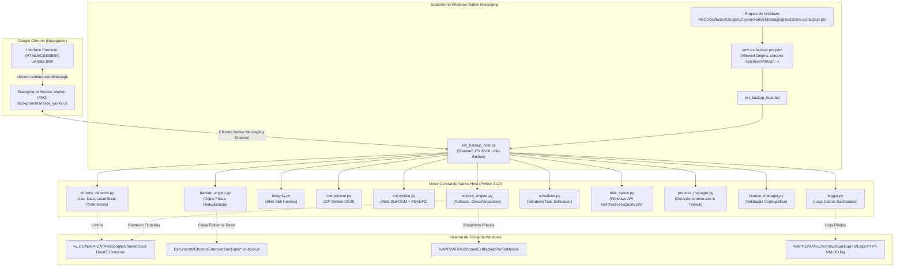

# Arquitetura Técnica - Chrome Extension Backup Pro

Documentação de engenharia e especificações técnicas de baixo nível da solução Chrome Extension Backup Pro para Windows.

---

## 1. Visão Geral da Arquitetura

O sistema implementa uma separação estrita de responsabilidades entre a interface de utilizador (executada em sandbox no Google Chrome como Extensão Manifest V3) e o subsistema de acesso ao sistema de ficheiros local do Windows (executado como processo nativo através do protocolo oficial **Chrome Native Messaging**).



---

## 2. Protocolo Native Messaging

A comunicação entre o Service Worker da extensão e o Native Host utiliza streams binários `stdin` e `stdout`:
- Cada mensagem transmitida é prefixada por um inteiro não-assinado de 32 bits (4 bytes em formato **Little-Endian** `<I`), indicando o comprimento em bytes do payload JSON em codificação UTF-8.
- O Host processa os comandos de forma assíncrona e devolve o resultado estruturado em formato JSON com o mesmo formato de empacotamento de 4 bytes.

Exemplo em Python de descodificação:
```python
raw_length = sys.stdin.buffer.read(4)
length = struct.unpack("<I", raw_length)[0]
payload_bytes = sys.stdin.buffer.read(length)
request = json.loads(payload_bytes.decode("utf-8"))
```

---

## 3. Especificação do Formato de Arquivo `.crxbackup`

O ficheiro `.crxbackup` é um container verificável estruturado. Na sua forma normal, é um arquivo ZIP RFC 1951/1952. Quando a opção de encriptação está ativa, o container é protegido por AES-256-GCM.

### Estrutura Interna do Arquivo:
```
NomeExtensao_ID_Versao_Timestamp.crxbackup/
├── manifest.json                  # Manifesto do backup com metadados e hash root
├── hashes/
│   └── hashes.json                # Mapa de ficheiros relativos para digests SHA-256
├── metadata/
│   └── metadata.json              # Metadados da extensão, permissões, OS, Chrome build
└── extension/                     # Árvore física completa dos ficheiros da extensão
    ├── manifest.json
    ├── background.js
    ├── popup.html
    ├── _locales/
    │   └── pt_PT/messages.json
    └── icons/
        └── icon48.png
```

### Cabeçalho do Ficheiro Encriptado (AES-256-GCM):
```
[0..7]   Bytes 0-7:   Magic Header ASCII "CRXENC01" (8 bytes)
[8..23]  Bytes 8-23:  Salt criptográfico PBKDF2 (16 bytes gerados via os.urandom)
[24..35] Bytes 24-35: Nonce / IV inicial (12 bytes)
[36..]   Bytes 36+:   Texto cifrado AES-256-GCM + Tag de autenticação (16 bytes no final)
```

---

## 4. Algoritmo de Deduplicação Incremental

Antes de duplicar um ficheiro:
1. O motor pesquisa o backup mais recente existente daquela extensão no diretório de destino.
2. Extrai o mapa de hashes anterior `hashes/hashes.json`.
3. Para cada ficheiro local:
   - Compara o tamanho (`os.path.getsize`) e data de modificação (`mtime`).
   - Se coincidirem, calcula o SHA-256 apenas se necessário para verificação e marca como ficheiro reutilizado (`reused_files += 1`).
   - Se divergir, marca como alterado (`changed_files += 1`) e efetua a cópia.
4. Regista no manifesto:
   ```json
   "incremental_stats": {
       "analyzed_files": 1245,
       "changed_files": 37,
       "reused_files": 1208,
       "saved_bytes": 448790528,
       "saved_formatted": "428.00 MB"
   }
   ```

---

## 5. Deteção de Processos e Bloqueio de Ficheiros

No Windows, quando o Google Chrome está em execução, determinados ficheiros de bases de dados (LevelDB, IndexedDB, Cache) são mantidos com `FILE_SHARE_READ` restrito ou locks exclusivos.
- O subsistema `process_manager.py` executa `tasklist /FI "IMAGENAME eq chrome.exe"` para apurar todos os PIDs ativos.
- Caso o restauro direto seja solicitado com o Chrome aberto, o sistema recusa a operação e apresenta o código de erro `RS-0002` com a opção de encerramento suave (`request_graceful_chrome_close`).
- O encerramento envia sinal `WM_CLOSE` via `taskkill /IM chrome.exe` apenas mediante autorização explícita do utilizador.
